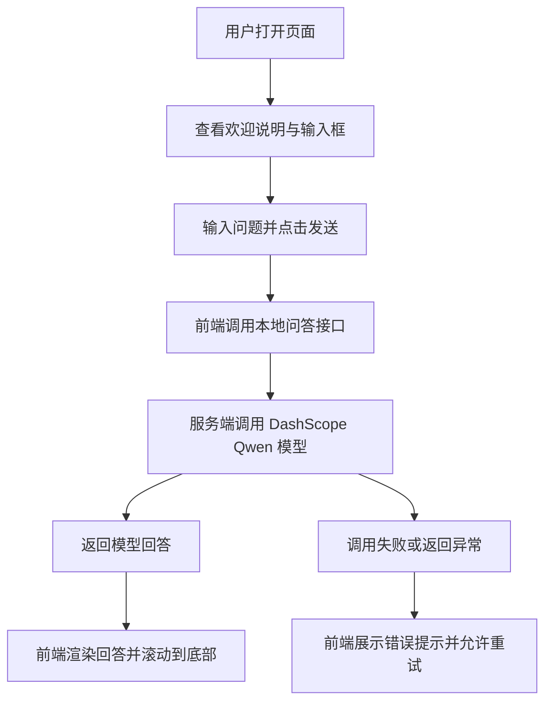

## 1. 产品概述
一个极简的网页问答机器人，用户打开页面即可输入问题并获得大模型回答，强调低门槛、低干扰和快速可用。
- 主要解决“想快速接入一个可用的大模型问答页面，但不想引入复杂业务系统”的问题，目标用户是开发者、演示场景使用者和个人工具型用户。
- 产品价值是以最少页面和最少操作完成一次完整问答闭环，同时保留后续扩展多轮对话、历史记录和角色设定的空间。

## 2. 核心功能

### 2.1 功能模块
1. **问答主页**：标题区、聊天记录区、问题输入区、发送按钮、加载状态、错误提示。
2. **配置能力**：通过环境变量配置 DashScope API Key、模型名和服务端端口，无需在前端暴露密钥。

### 2.2 页面明细
| 页面名称 | 模块名称 | 功能描述 |
|-----------|-----------|-----------|
| 问答主页 | 顶部标题区 | 展示产品名称、一句说明和当前模型标识 |
| 问答主页 | 对话流区域 | 按消息气泡展示用户提问与机器人回答，支持滚动浏览 |
| 问答主页 | 输入操作区 | 输入问题、发送问题、回车提交、按钮禁用态 |
| 问答主页 | 状态反馈区 | 展示“思考中”状态、请求失败提示、空状态引导 |

## 3. 核心流程
用户进入页面后，先看到简洁欢迎说明和输入框；输入问题并提交后，前端将内容发送到本地服务端接口；服务端调用 DashScope 的 Qwen 模型并返回答案；前端将答案追加到对话区并自动滚动到底部；若接口失败，则在页面中显示可读错误信息，方便用户重试。

## 4. 用户界面设计
### 4.1 设计风格
- 主色：近黑色背景 `#111111`，辅助色：柔和白 `#F5F5F0`，强调色：浅绿色 `#B8FF6A`
- 按钮风格：扁平化圆角按钮，弱阴影，悬停时轻微提亮
- 字体建议：标题使用有个性的衬线展示字体，正文使用清晰的无衬线字体
- 布局风格：单列居中、留白充足、卡片化聊天区域
- 图标建议：尽量克制，使用简洁线性图标或纯文字标签

### 4.2 页面设计概览
| 页面名称 | 模块名称 | UI 元素 |
|-----------|-----------|----------|
| 问答主页 | 顶部标题区 | 大标题、副标题、模型标签、极简分隔线 |
| 问答主页 | 对话流区域 | 深色卡片、圆角气泡、不同角色对齐、细腻滚动条 |
| 问答主页 | 输入操作区 | 大号文本框、发送按钮、提交快捷键提示 |
| 问答主页 | 状态反馈区 | 点状加载动画、浅红错误提示、空状态引导文案 |

### 4.3 响应式策略
采用桌面优先设计，同时兼容移动端：
- 桌面端保持内容居中并限制最大宽度，提升阅读舒适度。
- 移动端压缩边距、缩短标题层级、确保输入框和按钮便于触控。
- 对话区高度随视口变化自适应，避免输入区遮挡消息内容。
