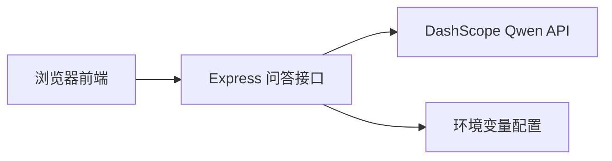
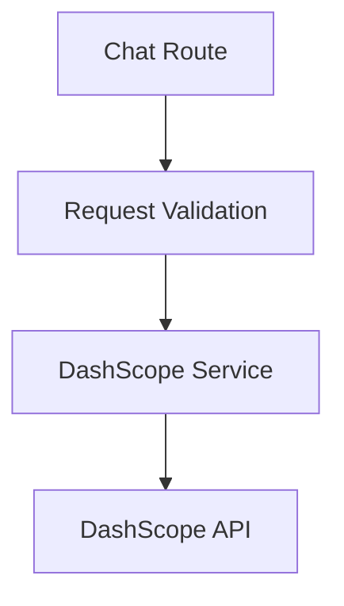

## 1. 架构设计


## 2. 技术说明
- 前端：React 18 + Vite + 原生 CSS
- 后端：Node.js + Express
- 接口通信：前端通过 `fetch` 调用本地 `/api/chat`
- 外部服务：DashScope 文本生成接口，模型默认使用 Qwen 系列可配置名称
- 运行方式：前后端同仓库开发，生产可由 Express 托管前端静态资源

## 3. 路由定义
| 路由 | 用途 |
|------|------|
| `/` | 问答主页 |
| `/api/chat` | 接收问题并返回 Qwen 模型回答 |

## 4. API 定义

### 4.1 POST `/api/chat`

请求体：

```ts
type ChatRequest = {
  message: string;
};
```

响应体：

```ts
type ChatResponse = {
  reply: string;
  model: string;
};
```

错误响应：

```ts
type ErrorResponse = {
  error: string;
};
```

接口约束：
- 当 `message` 为空或只包含空白字符时，返回 `400`。
- 当 DashScope 请求失败时，服务端返回可读错误信息，前端负责展示。
- 服务端通过环境变量 `DASHSCOPE_API_KEY` 读取密钥，通过 `QWEN_MODEL` 读取模型名。

## 5. 服务端架构图


## 6. 数据模型
当前版本为极简问答机器人，不引入数据库，仅在前端内存中维护当前会话消息列表。

### 6.1 前端消息模型
```ts
type Message = {
  id: string;
  role: "user" | "assistant";
  content: string;
};
```

## 7. 部署与配置
- 本地开发使用两个端口：Vite 前端开发服务与 Express API 服务。
- 前端通过 Vite 代理将 `/api` 转发到 Express，避免跨域问题。
- 生产环境中先构建前端，再由 Express 托管 `dist` 目录。
- 必需环境变量：
  - `DASHSCOPE_API_KEY`
  - `QWEN_MODEL`
  - `PORT`
